# Cat-Pack-Utilities — Architecture / Data-Dependency Map

> Auto-generated by `arch_map.py` from a static AST scan of the *.py files in this directory — do NOT hand-edit. Re-run `python3 arch_map.py` after adding/removing a script or a packenv key.

56 scripts scanned · 15 script→script import edges · 90 script→data-artifact edges · 22 distinct packenv data artifacts.

## Diagram

```mermaid
flowchart LR
    classDef script fill:#1f6feb,color:#ffffff,stroke:#0b3d91,stroke-width:1px;
    classDef hub fill:#8250df,color:#ffffff,stroke:#4b1a91,stroke-width:2px;
    classDef data fill:#f2cc60,color:#222222,stroke:#946200,stroke-width:1px;

    subgraph CLUSTER_BUNDLE["Bundle / mod-director"]
        S_bundle_check["bundle_check.py"]
        S_bundle_drift["bundle_drift.py"]
        S_bundle_regression_gate["bundle_regression_gate.py<br/>(git)"]
    end

    subgraph CLUSTER_CHANGELOG["Changelog"]
        S_changelog_from_bundles["changelog_from_bundles.py<br/>(git)"]
        S_changelog_from_git["changelog_from_git.py<br/>(git)"]
    end

    subgraph CLUSTER_INSTANCE["Instance tools"]
        S_make_minimal_instance["make_minimal_instance.py"]
    end

    subgraph CLUSTER_RELEASE["Release"]
        S_cf_upload["cf_upload.py"]
        S_modrinth_upload["modrinth_upload.py"]
        S_release["release.py"]
        S_release_changeset["release_changeset.py<br/>(git)"]
        S_release_log["release_log.py<br/>(git)"]
        S_release_mods["release_mods.py<br/>(gh,git)"]
        S_release_pack["release_pack.py<br/>(git,gradle)"]
    end

    S__installdependencies["!installdependencies.py"]
    S_MainClass["MainClass.py"]
    S_arch_map["arch_map.py"]
    S_baseline_capture["baseline_capture.py<br/>(git)"]
    S_baseline_pair["baseline_pair.py"]
    S_baseline_run["baseline_run.py"]
    S_boot_crash_scan["boot_crash_scan.py"]
    S_boot_profiler["boot_profiler.py"]
    S_cascade_report["cascade_report.py"]
    S_census["census.py"]
    S_chunkgen_bench["chunkgen_bench.py"]
    S_config_sync["config_sync.py"]
    S_decouple_dag["decouple_dag.py"]
    S_deploy_prism["deploy_prism.py"]
    S_dist_parity["dist_parity.py<br/>(gh)"]
    S_gate["gate.py"]
    S_gcsoak["gcsoak.py"]
    S_gen_legacy_hashes["gen_legacy_hashes.py<br/>(git)"]
    S_gen_placeholder_logos["gen_placeholder_logos.py"]
    S_housekeep["housekeep.py"]
    S_matou_bench["matou_bench.py"]
    S_matou_server_smoke["matou_server_smoke.py"]
    S_matoulib_arch["matoulib_arch.py"]
    S_mixin_collision["mixin_collision.py"]
    S_mod_update_checker["mod_update_checker.py<br/>(gh)"]
    S_pack_sync["pack_sync.py<br/>(gh)"]
    S_packenv["packenv.py"]
    S_pathfind_test["pathfind_test.py"]
    S_pathnav_test["pathnav_test.py"]
    S_perf_bench["perf_bench.py"]
    S_pipeline_status["pipeline_status.py<br/>(git)"]
    S_reserve_slugs["reserve_slugs.py"]
    S_scan_repos["scan_repos.py<br/>(git)"]
    S_security_audit["security_audit.py<br/>(gh)"]
    S_server_bootstrap_parity["server_bootstrap_parity.py"]
    S_spark_find["spark_find.py"]
    S_spark_parse["spark_parse.py"]
    S_spark_profile["spark_profile.py"]
    S_triage_forks["triage_forks.py<br/>(gh)"]
    S_update_local["update_local.py"]
    S_uv_template["uv_template.py"]
    S_vanilla_import_map["vanilla_import_map.py"]
    S_wiki_sync["wiki_sync.py"]

    subgraph PACKENV_DATA["packenv.py data artifacts"]
        D_ART_SECRETS[(".env secrets (CF/Modrinth tokens)")]
        D_ART_HUB[("Mod-Sandbox hub root")]
        D_ART_INSTANCE_SERVER[("SERVER instance")]
        D_ART_INSTANCE_TEST[("TEST client instance")]
        D_ART_CLIENT_MANIFEST[("client manifest.json")]
        D_ART_CURSE_BUNDLE[("curse.bundle.json")]
        D_ART_INSTANCES_ROOT[("instances root dir")]
        D_ART_MODRINTH_BUNDLE[("modrinth.bundle.json")]
        D_ART_PACK_DIR[("pack repo (PACK_DIR family)")]
        D_ART_OTHER_BENCH_CAPTURES[("packenv.BENCH_CAPTURES (unclassified)")]
        D_ART_OTHER_FORGE_SERVER_TEMPLATE[("packenv.FORGE_SERVER_TEMPLATE (unclassified)")]
        D_ART_OTHER_GATE_DISPLAY[("packenv.GATE_DISPLAY (unclassified)")]
        D_ART_OTHER_GATE_PLAYER[("packenv.GATE_PLAYER (unclassified)")]
        D_ART_OTHER_INSTANCE_MATOU[("packenv.INSTANCE_MATOU (unclassified)")]
        D_ART_OTHER_INSTANCE_MATOU_CONFIG[("packenv.INSTANCE_MATOU_CONFIG (unclassified)")]
        D_ART_OTHER_PRISM_BIN[("packenv.PRISM_BIN (unclassified)")]
        D_ART_OTHER_PRISM_ROOT[("packenv.PRISM_ROOT (unclassified)")]
        D_ART_OTHER_RPC_HOST[("packenv.RPC_HOST (unclassified)")]
        D_ART_OTHER_RPC_PORT[("packenv.RPC_PORT (unclassified)")]
        D_ART_RELEASE_MANIFEST[("release-manifest.json")]
        D_ART_REPOS_JSON[("repos.json")]
        D_ART_URL_BUNDLE[("url.bundle.json")]
    end

    %% script -> script (imports)
    S_bundle_regression_gate --> S_changelog_from_bundles
    S_decouple_dag --> S_vanilla_import_map
    S_dist_parity --> S_release_mods
    S_matou_bench --> S_chunkgen_bench
    S_matou_server_smoke --> S_boot_crash_scan
    S_pipeline_status --> S_pack_sync
    S_release_changeset --> S_bundle_drift
    S_release_changeset --> S_changelog_from_git
    S_release_mods --> S_changelog_from_git
    S_release_mods --> S_make_minimal_instance
    S_release_mods --> S_modrinth_upload
    S_release_mods --> S_release_log
    S_release_pack --> S_changelog_from_bundles
    S_release_pack --> S_release_log
    S_release_pack --> S_release_mods

    %% script -> packenv data artifact (uses)
    S_baseline_capture -.-> D_ART_OTHER_BENCH_CAPTURES
    S_baseline_capture -.-> D_ART_OTHER_INSTANCE_MATOU
    S_baseline_capture -.-> D_ART_OTHER_INSTANCE_MATOU_CONFIG
    S_baseline_capture -.-> D_ART_REPOS_JSON
    S_baseline_pair -.-> D_ART_HUB
    S_baseline_run -.-> D_ART_OTHER_RPC_HOST
    S_baseline_run -.-> D_ART_OTHER_RPC_PORT
    S_bundle_check -.-> D_ART_SECRETS
    S_bundle_check -.-> D_ART_PACK_DIR
    S_bundle_drift -.-> D_ART_SECRETS
    S_bundle_drift -.-> D_ART_INSTANCE_SERVER
    S_bundle_drift -.-> D_ART_INSTANCE_TEST
    S_bundle_drift -.-> D_ART_PACK_DIR
    S_cf_upload -.-> D_ART_SECRETS
    S_changelog_from_bundles -.-> D_ART_CLIENT_MANIFEST
    S_changelog_from_bundles -.-> D_ART_CURSE_BUNDLE
    S_changelog_from_bundles -.-> D_ART_MODRINTH_BUNDLE
    S_changelog_from_bundles -.-> D_ART_PACK_DIR
    S_changelog_from_bundles -.-> D_ART_URL_BUNDLE
    S_changelog_from_git -.-> D_ART_REPOS_JSON
    S_chunkgen_bench -.-> D_ART_OTHER_BENCH_CAPTURES
    S_config_sync -.-> D_ART_INSTANCE_SERVER
    S_config_sync -.-> D_ART_INSTANCE_TEST
    S_config_sync -.-> D_ART_PACK_DIR
    S_deploy_prism -.-> D_ART_OTHER_PRISM_ROOT
    S_deploy_prism -.-> D_ART_REPOS_JSON
    S_dist_parity -.-> D_ART_SECRETS
    S_dist_parity -.-> D_ART_HUB
    S_dist_parity -.-> D_ART_RELEASE_MANIFEST
    S_dist_parity -.-> D_ART_REPOS_JSON
    S_gate -.-> D_ART_OTHER_GATE_DISPLAY
    S_gate -.-> D_ART_OTHER_GATE_PLAYER
    S_gate -.-> D_ART_OTHER_PRISM_BIN
    S_gate -.-> D_ART_OTHER_PRISM_ROOT
    S_gate -.-> D_ART_OTHER_RPC_HOST
    S_gate -.-> D_ART_OTHER_RPC_PORT
    S_gen_legacy_hashes -.-> D_ART_REPOS_JSON
    S_housekeep -.-> D_ART_HUB
    S_make_minimal_instance -.-> D_ART_HUB
    S_make_minimal_instance -.-> D_ART_INSTANCE_TEST
    S_make_minimal_instance -.-> D_ART_INSTANCES_ROOT
    S_matou_bench -.-> D_ART_OTHER_BENCH_CAPTURES
    S_matou_bench -.-> D_ART_OTHER_PRISM_ROOT
    S_matou_server_smoke -.-> D_ART_OTHER_FORGE_SERVER_TEMPLATE
    S_matou_server_smoke -.-> D_ART_OTHER_PRISM_ROOT
    S_matou_server_smoke -.-> D_ART_REPOS_JSON
    S_matoulib_arch -.-> D_ART_REPOS_JSON
    S_mixin_collision -.-> D_ART_HUB
    S_mixin_collision -.-> D_ART_INSTANCE_TEST
    S_mod_update_checker -.-> D_ART_SECRETS
    S_mod_update_checker -.-> D_ART_INSTANCE_TEST
    S_modrinth_upload -.-> D_ART_SECRETS
    S_pack_sync -.-> D_ART_SECRETS
    S_pack_sync -.-> D_ART_HUB
    S_pack_sync -.-> D_ART_CLIENT_MANIFEST
    S_pack_sync -.-> D_ART_CURSE_BUNDLE
    S_pack_sync -.-> D_ART_PACK_DIR
    S_pack_sync -.-> D_ART_RELEASE_MANIFEST
    S_pack_sync -.-> D_ART_URL_BUNDLE
    S_packenv -.-> D_ART_SECRETS
    S_perf_bench -.-> D_ART_HUB
    S_pipeline_status -.-> D_ART_PACK_DIR
    S_pipeline_status -.-> D_ART_RELEASE_MANIFEST
    S_release -.-> D_ART_HUB
    S_release -.-> D_ART_INSTANCE_SERVER
    S_release -.-> D_ART_INSTANCE_TEST
    S_release_changeset -.-> D_ART_REPOS_JSON
    S_release_mods -.-> D_ART_SECRETS
    S_release_mods -.-> D_ART_RELEASE_MANIFEST
    S_release_pack -.-> D_ART_SECRETS
    S_release_pack -.-> D_ART_INSTANCE_TEST
    S_release_pack -.-> D_ART_PACK_DIR
    S_release_pack -.-> D_ART_RELEASE_MANIFEST
    S_reserve_slugs -.-> D_ART_SECRETS
    S_reserve_slugs -.-> D_ART_RELEASE_MANIFEST
    S_scan_repos -.-> D_ART_HUB
    S_scan_repos -.-> D_ART_RELEASE_MANIFEST
    S_scan_repos -.-> D_ART_REPOS_JSON
    S_security_audit -.-> D_ART_REPOS_JSON
    S_server_bootstrap_parity -.-> D_ART_CURSE_BUNDLE
    S_server_bootstrap_parity -.-> D_ART_PACK_DIR
    S_server_bootstrap_parity -.-> D_ART_URL_BUNDLE
    S_spark_profile -.-> D_ART_INSTANCE_TEST
    S_triage_forks -.-> D_ART_REPOS_JSON
    S_update_local -.-> D_ART_HUB
    S_update_local -.-> D_ART_INSTANCE_SERVER
    S_update_local -.-> D_ART_INSTANCE_TEST
    S_update_local -.-> D_ART_RELEASE_MANIFEST
    S_vanilla_import_map -.-> D_ART_REPOS_JSON
    S_wiki_sync -.-> D_ART_HUB

    class S_bundle_check,S_bundle_drift,S_bundle_regression_gate,S_changelog_from_bundles,S_changelog_from_git,S_make_minimal_instance,S_cf_upload,S_modrinth_upload,S_release,S_release_changeset,S_release_log,S_release_mods,S_release_pack,S__installdependencies,S_MainClass,S_arch_map,S_baseline_capture,S_baseline_pair,S_baseline_run,S_boot_crash_scan,S_boot_profiler,S_cascade_report,S_census,S_chunkgen_bench,S_config_sync,S_decouple_dag,S_deploy_prism,S_dist_parity,S_gate,S_gcsoak,S_gen_legacy_hashes,S_gen_placeholder_logos,S_housekeep,S_matou_bench,S_matou_server_smoke,S_matoulib_arch,S_mixin_collision,S_mod_update_checker,S_pack_sync,S_pathfind_test,S_pathnav_test,S_perf_bench,S_pipeline_status,S_reserve_slugs,S_scan_repos,S_security_audit,S_server_bootstrap_parity,S_spark_find,S_spark_parse,S_spark_profile,S_triage_forks,S_update_local,S_uv_template,S_vanilla_import_map,S_wiki_sync script;
    class S_packenv hub;
    class D_ART_CLIENT_MANIFEST,D_ART_CURSE_BUNDLE,D_ART_HUB,D_ART_INSTANCES_ROOT,D_ART_INSTANCE_SERVER,D_ART_INSTANCE_TEST,D_ART_MODRINTH_BUNDLE,D_ART_OTHER_BENCH_CAPTURES,D_ART_OTHER_FORGE_SERVER_TEMPLATE,D_ART_OTHER_GATE_DISPLAY,D_ART_OTHER_GATE_PLAYER,D_ART_OTHER_INSTANCE_MATOU,D_ART_OTHER_INSTANCE_MATOU_CONFIG,D_ART_OTHER_PRISM_BIN,D_ART_OTHER_PRISM_ROOT,D_ART_OTHER_RPC_HOST,D_ART_OTHER_RPC_PORT,D_ART_PACK_DIR,D_ART_RELEASE_MANIFEST,D_ART_REPOS_JSON,D_ART_SECRETS,D_ART_URL_BUNDLE data;
```

Solid arrows = local `import`; dashed arrows = packenv (`E.<KEY>`) data-artifact use. The purple node is `packenv.py`, the hub every other script's paths/ids flow through.

## Overview table

| Script | Purpose | Reads / uses (data artifacts) | Depends on (scripts) |
|---|---|---|---|
| `!installdependencies.py` | (no module docstring) | — | — |
| `arch_map.py` | auto-generates ARCHITECTURE.md, a data-dependency map of the pack tooling. | — | — |
| `baseline_capture.py` | Capture a matou-engine T-02 frame baseline, WITH the flag profile that produced it. _[git]_ | packenv.BENCH_CAPTURES (unclassified), packenv.INSTANCE_MATOU (unclassified), packenv.INSTANCE_MATOU_CONFIG (unclassified), repos.json | — |
| `baseline_pair.py` | Produce BOTH matou-engine T-02 baselines unattended: flags → launch → traverse → capture, twice. | Mod-Sandbox hub root | — |
| `baseline_run.py` | Drive a REPRODUCIBLE traversal over the matoulib devtools RPC, for matou-engine T-02 baselines. | packenv.RPC_HOST (unclassified), packenv.RPC_PORT (unclassified) | — |
| `boot_crash_scan.py` | attribute a Minecraft/FML boot failure to the culprit mod. | — | — |
| `boot_profiler.py` | Profile 1.7.10 boot times per mod from FML logs. | — | — |
| `bundle_check.py` | pre-release validator for a modpack's mod-director bundles. | .env secrets (CF/Modrinth tokens), pack repo (PACK_DIR family) | — |
| `bundle_drift.py` | bidirectional drift between a TEST instance's mods/ and the CANONICAL bundles. | .env secrets (CF/Modrinth tokens), SERVER instance, TEST client instance, pack repo (PACK_DIR family) | — |
| `bundle_regression_gate.py` | a pack mod must NEVER ship an OLDER version than a previously published cut. _[git]_ | — | changelog_from_bundles.py |
| `cascade_report.py` | Aggregate ArchaicFix cascading-worldgen warnings from 1.7.10 logs. | — | — |
| `census.py` | Rank which modpack mod/subsystem to convert to matoulib's DATA-DRIVEN systems FIRST. | — | — |
| `cf_upload.py` | upload a mod jar to CurseForge via the author Upload API. | .env secrets (CF/Modrinth tokens) | — |
| `changelog_from_bundles.py` | Generate the pack changelog's added/updated/removed sections from the GIT DIFF of the mod-director… _[git]_ | client manifest.json, curse.bundle.json, modrinth.bundle.json, pack repo (PACK_DIR family), url.bundle.json | — |
| `changelog_from_git.py` | DERIVE each mod's pending changelog from its git commits since the last release tag, so a changelog… _[git]_ | repos.json | — |
| `chunkgen_bench.py` | RIGOROUS chunk-generation benchmark harness for the async-chunk rewrite. | packenv.BENCH_CAPTURES (unclassified) | — |
| `config_sync.py` | sync a pack game-config between the CANONICAL source and the local test instances (client + server). | SERVER instance, TEST client instance, pack repo (PACK_DIR family) | — |
| `decouple_dag.py` | the vanilla base-class DROP cascade, derived (PROTOTYPE). | — | vanilla_import_map.py |
| `deploy_prism.py` | keep PrismLauncher test instances in sync with freshly built personal-mod jars. | packenv.PRISM_ROOT (unclassified), repos.json | — |
| `dist_parity.py` | GitHub vs Modrinth/CurseForge release-parity checker for the personal 1.7.10 mods. _[gh]_ | .env secrets (CF/Modrinth tokens), Mod-Sandbox hub root, release-manifest.json, repos.json | release_mods.py |
| `gate.py` | one-call game-gate launch / flags / stop for the matoulib Prism TEST instances. | packenv.GATE_DISPLAY (unclassified), packenv.GATE_PLAYER (unclassified), packenv.PRISM_BIN (unclassified), packenv.PRISM_ROOT (unclassified), packenv.RPC_HOST (unclassified), packenv.RPC_PORT (unclassified) | — |
| `gcsoak.py` | S0 GC-soak referee (docs/105 §P7 / §506, the binding zero-alloc gate). | — | — |
| `gen_legacy_hashes.py` | One-shot generator for a mod's `_legacy_hashes.json` (hub doc 60 §3). _[git]_ | repos.json | — |
| `gen_placeholder_logos.py` | deterministic placeholder brand logos for the clean-room projects (docs/26). | — | — |
| `housekeep.py` | keep the Mod-Sandbox memory files from bloating. | Mod-Sandbox hub root | — |
| `MainClass.py` | (no module docstring) | — | — |
| `make_minimal_instance.py` | Build a fast-boot MINIMAL instance to de-risk a single mixin/mod before the full pack. | Mod-Sandbox hub root, TEST client instance, instances root dir | — |
| `matou_bench.py` | automated TPS/FPS A/B bench over FULL game-leg lifecycles (Prism Minimal-Matou). | packenv.BENCH_CAPTURES (unclassified), packenv.PRISM_ROOT (unclassified) | chunkgen_bench.py |
| `matou_server_smoke.py` | boot a minimal Forge 1.7.10 DEDICATED server with matoulib+gigafauna and gate on a boot crash. | packenv.FORGE_SERVER_TEMPLATE (unclassified), packenv.PRISM_ROOT (unclassified), repos.json | boot_crash_scan.py |
| `matoulib_arch.py` | auto-generates <repo>/ARCHITECTURE.md, a seam map of a matou mod source tree. | repos.json | — |
| `mixin_collision.py` | cross-mod contested-target report for OaT mixins. | Mod-Sandbox hub root, TEST client instance | — |
| `mod_update_checker.py` | Mod update checker for FileDirector-managed 1.7.10 packs. _[gh]_ | .env secrets (CF/Modrinth tokens), TEST client instance | — |
| `modrinth_upload.py` | upload a mod jar as a new version on Modrinth. | .env secrets (CF/Modrinth tokens) | — |
| `pack_sync.py` | Sync freshly-released mod fileIDs into the modpack config, then verify — the step that actually del… _[gh]_ | .env secrets (CF/Modrinth tokens), Mod-Sandbox hub root, client manifest.json, curse.bundle.json, pack repo (PACK_DIR family), release-manifest.json, url.bundle.json | — |
| `packenv.py` | single source of truth for every path/id the pack tooling needs. | .env secrets (CF/Modrinth tokens) | — |
| `pathfind_test.py` | Automated in-game pathfinding regression test for the OaT async pathfinding refonte (BUG-008). | — | — |
| `pathnav_test.py` | Generic pathfinding test that tolerates 1.7.10's intermittent mob AI. | — | — |
| `perf_bench.py` | "where is the time lost" profiler for the matoulib de-risk battery. | Mod-Sandbox hub root | — |
| `pipeline_status.py` | end-to-end delivery dashboard: is the work we validated actually SHIPPED? _[git]_ | pack repo (PACK_DIR family), release-manifest.json | pack_sync.py |
| `release.py` | Biggess Pack Cat Edition release pipeline. | Mod-Sandbox hub root, SERVER instance, TEST client instance | — |
| `release_changeset.py` | pre-release derivation of "what needs shipping in the next pack release", by UNIONING two independe… _[git]_ | repos.json | bundle_drift.py, changelog_from_git.py |
| `release_log.py` | append-only markdown logger for release runs. _[git]_ | — | — |
| `release_mods.py` | bulk release the pending mods from release_manifest.json. _[gh,git]_ | .env secrets (CF/Modrinth tokens), release-manifest.json | changelog_from_git.py, make_minimal_instance.py, modrinth_upload.py, release_log.py |
| `release_pack.py` | gated one-shot release pipeline for the modpack (Biggess Pack Cat Edition). _[git,gradle]_ | .env secrets (CF/Modrinth tokens), TEST client instance, pack repo (PACK_DIR family), release-manifest.json | changelog_from_bundles.py, release_log.py, release_mods.py |
| `reserve_slugs.py` | reserve the clean-room project slugs (docs/26) on Modrinth + CurseForge. | .env secrets (CF/Modrinth tokens), release-manifest.json | — |
| `scan_repos.py` | Scan ~/Documents/GitHub for repos owned by quentin452/iamacat and write the canonical inventory to… _[git]_ | Mod-Sandbox hub root, release-manifest.json, repos.json | — |
| `security_audit.py` | pull GitHub security + quality alerts across the OWNED MODS and surface them. _[gh]_ | repos.json | — |
| `server_bootstrap_parity.py` | guard server-side correctness vs the pack's declared bundles. | curse.bundle.json, pack repo (PACK_DIR family), url.bundle.json | — |
| `spark_find.py` | Find every occurrence of a method in a .sparkprofile and print its caller chain + time share. | — | — |
| `spark_parse.py` | Parse a spark .sparkprofile (raw protobuf, no schema needed) into a hot-path tree on stdout. | — | — |
| `spark_profile.py` | Drive the in-game spark profiler over the matoulib RPC and collect the .sparkprofile locally. | TEST client instance | — |
| `triage_forks.py` | Triage open issues + PRs across the forks/mods in memory/repos.json (the auto-generated inventory). _[gh]_ | repos.json | — |
| `update_local.py` | swap freshly-built personal-mod jars into the local instances. | Mod-Sandbox hub root, SERVER instance, TEST client instance, release-manifest.json | — |
| `uv_template.py` | emit a labeled UV-unwrap template PNG from bedrock .geo.json models. | — | — |
| `vanilla_import_map.py` | auto-generates <repo>/VANILLA-IMPORTS.md, the engine-exit prioritisation map. | repos.json | — |
| `wiki_sync.py` | generate the OptimizationsAndTweaks wiki Mixins page FROM THE CODE. | Mod-Sandbox hub root | — |
